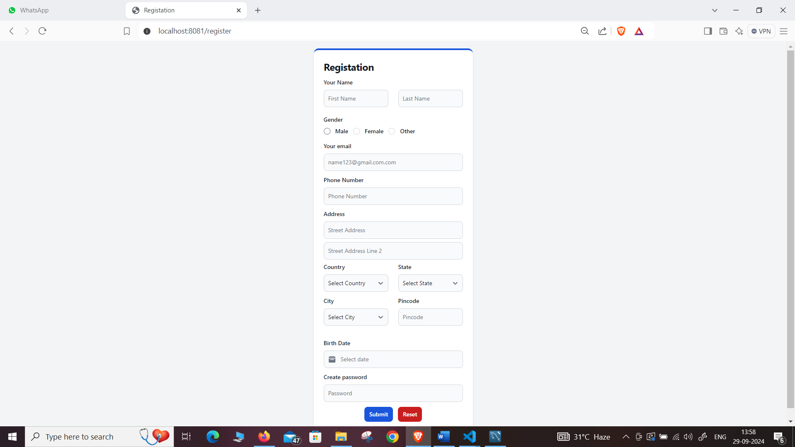
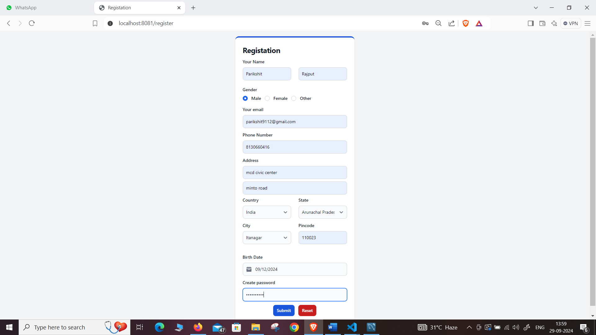
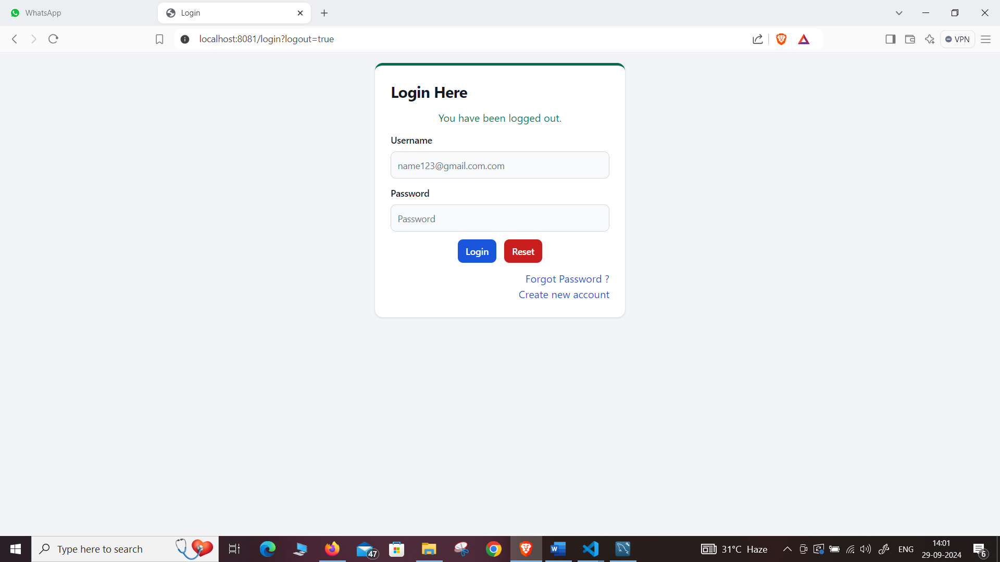
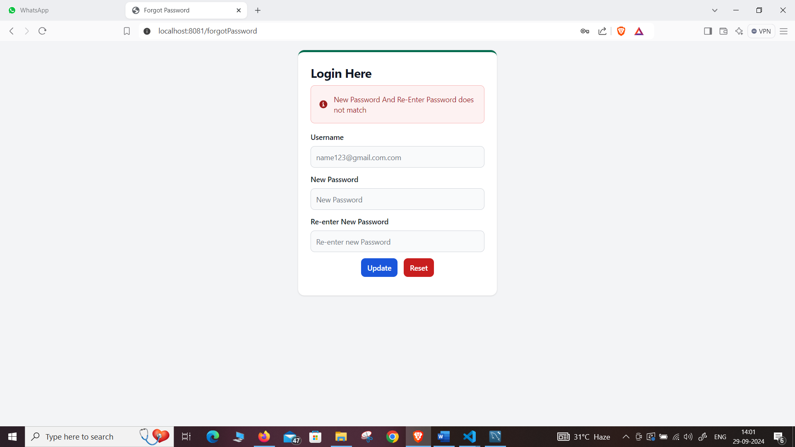
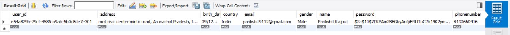

# User Registration System

This project is a **User Registration System** that includes functionalities such as user login, registration, and forgot password. It is built using **Java**, **Spring Boot**, **JPA**, **Spring Security**, **Thymeleaf**, **Tailwind CSS**, **HTML**, **CSS**, **JavaScript**, **jQuery**, and **MySQL**.

## Features

- **User Registration**: Allows users to create a new account by providing their details.
- **Login**: Users can log in with their registered email and password.
- **Forgot Password**: Users can reset their password by providing a registered email.
- **Secure Authentication**: The application uses Spring Security to protect sensitive routes and ensure secure authentication.

## Technologies Used

- **Backend**: 
  - Java
  - Spring Boot
  - Spring Security
  - JPA (Java Persistence API)

- **Frontend**:
  - Thymeleaf (for templating)
  - Tailwind CSS (for styling)
  - HTML5, CSS3, JavaScript, jQuery

- **Database**: 
  - MySQL

## Getting Started

### Prerequisites

To run this project locally, you need to have the following installed:

- **Java** (JDK 17 or higher)
- **Maven** (for dependency management)
- **MySQL** (for the database)

### Installation

1. **Clone the repository**:
   ```bash
   git clone https://github.com/your-username/your-repo-name.git
   cd your-repo-name

2.Set up MySQL:

    Create a database in MySQL:

    CREATE DATABASE user_registration_system;

Update the application.properties file with your MySQL configuration:

properties

spring.datasource.url=jdbc:mysql://localhost:3306/user_registration_system
spring.datasource.username=your-username
spring.datasource.password=your-password

3.Run the application:

mvn spring-boot:run


Project Structure

    src/main/java: Contains the Java source code.
        controller: Handles incoming HTTP requests.
        service: Contains the business logic of the application.
        repository: Handles interactions with the database.
        model: Defines the database entities.

    src/main/resources:
        templates: Contains Thymeleaf templates for views (e.g., registration, login, forgot password).
        static: Holds static resources like CSS, JavaScript, and images.

How It Works

    User Registration: Users can register by filling out a form with their name, email, password, etc. The password is encrypted using Spring Security's BCrypt algorithm before being saved in the database.

    Login: Users can log in by providing their registered email and password. Spring Security handles the authentication and authorization process.

    Forgot Password: Users can request a password reset by providing their registered email. A password reset token is generated and sent via email (integration with Java Mail API can be implemented for this).

Screenshots
Registration Page






Login Page





Forgot Password Page




Database



Future Enhancements

    Implement email verification during registration.
    Integrate with an external email service for password reset functionality.
    Improve UI/UX with more interactive elements.
